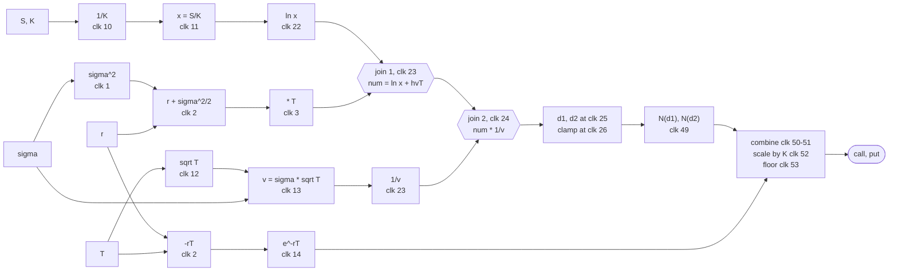

# Fixed-Point Elementary Functions in SystemVerilog

A collection of **pipelined fixed-point mathematical functions for FPGAs**, written from scratch in SystemVerilog.

The library implements common operations such as reciprocal, square root, logarithm, exponential, and the standard normal CDF without relying on floating-point hardware. Each module is fully pipelined and parameterized by its input/output width and binary-point position.

As a larger integration example, the repository also contains a complete **Black-Scholes option pricer** built entirely from these modules.

The design has been verified bit-for-bit against Python/NumPy reference models and characterized using Vivado.

## Why this project?

Functions such as

```text
1/x
sqrt(x)
ln(x)
exp(x)
N(x)
```

are straightforward in software, but implementing them efficiently in FPGA hardware is a different problem.

Floating-point implementations can be expensive, while fixed-point implementations require explicit decisions about:

- numerical range
- precision
- rounding
- saturation
- intermediate widths
- polynomial approximation
- pipeline depth
- DSP usage

This library explores those trade-offs using synthesizable, parameterized SystemVerilog.

---

## Library overview

| Module | Function | Latency | Default format |
|---|---|---:|---|
| `lzc_norm` | Leading zero count and normalization | 2 | `W=32` |
| `poly_eval` | Degree 5 polynomial using Estrin evaluation | 7 | `X/C/W = 18` |
| `recip_unit` | `1/a`, seed table + Newton refinement | 10 | `32.28 → 24.22` |
| `sqrt_unit` | `sqrt(a)`, seed table + Newton refinement | 12 | `32.28 → 24.21` |
| `ln_unit` | `ln(a)`, range reduction + polynomial | 11 | `32.28 → 24` |
| `exp_unit` | `e^x`, range reduction + polynomial | 12 | `18.17 → 32.31` |
| `norm_cdf` | Standard normal CDF `N(x)` | 23 | `26.22 → 26.25` |
| `bs_pricer_top` | Black-Scholes call and put pricing | 53 | See source |

The modules use a simple `in_valid` / `out_valid` streaming interface. There is no backpressure: once data enters the pipeline, it continues through at one stage per clock.

---

## Fixed-point representation

Widths and binary points are explicit parameters.

For example, a format described as:

```text
32.28
```

uses a 32-bit value with 28 fractional bits.

The stored integer therefore represents:

```text
real_value = stored_value / 2^28
```

---

## Verification

The Python implementation is treated as the numerical specification for the RTL.

The repository contains:

```text
model/   NumPy fixed-point reference models
tb/      cocotb testbenches
rtl/     synthesizable SystemVerilog
```

All models share the same `Fmt` / `Fx` fixed-point layer so that width changes, rounding, and saturation behave exactly like the RTL.

Each hardware module is tested under Verilator and compared bit for bit against its Python equivalent.

---

## Accuracy

Against double-precision Black-Scholes over the tested parameter range:

| Measure | Result |
|---|---:|
| Call price error | `2.214e-06` of K — 18.8 bits |
| Put price error | `2.237e-06` of K — 18.8 bits |
| Put-call parity using module outputs | `1.711e-06` — 19.2 bits |
| `norm_cdf` vs fixed-point model | 1625 samples bit-exact |
| CDF symmetry | 811 pairs exact |
| `bs_pricer_top` vs fixed-point model | 2032 samples bit-exact |
| Negative option prices observed | 0 |

Error increases by roughly 3× as `S/K` moves from the low end of the tested range to the high end.


---

## Black-Scholes integration example

The top-level example implements the standard European Black-Scholes equations:

```text
v  = sigma * sqrt(T)

d1 = [ln(S/K) + (r + sigma^2/2)T] / v

d2 = d1 - v

C = S*N(d1) - K*exp(-rT)*N(d2)

P = K*exp(-rT)*N(-d2) - S*N(-d1)
```

Rather than implementing division directly, the design calculates:

```text
1/K
1/v
```

using `recip_unit`, then performs multiplication.

The complete pricer contains:

- 2 × `recip_unit`
- 1 × `sqrt_unit`
- 1 × `ln_unit`
- 1 × `exp_unit`
- 2 × `norm_cdf`

The remaining top-level logic handles fixed-point arithmetic, pipeline scheduling, and alignment between branches.

### Pipeline structure

The calculation naturally separates into several parallel branches:



These branches have different latencies, so the top module contains nine delay lines to align values before they meet.

The delay lines are intentionally left unreset, allowing Vivado to infer them as **SRLs rather than long flip-flop chains**.

The complete pipeline has:

```text
Latency:    53 clocks
Throughput: 1 call/put pair per clock after pipeline fill
```

### CDF symmetry

The put calculation does not require two additional CDF evaluations.

Instead:

```text
N(-x) = 1 - N(x)
```

Since the `norm_cdf` output format represents `1.0` exactly, the complement can be implemented as an exact subtraction:

```text
N(x) + N(-x) = 1
```

to the last bit.

This means both the call and put can be generated from only **two `norm_cdf` instances**.

---

## FPGA characterization

Out-of-context synthesis, placement and routing on the target device:

```text
Vivado 2026.1
xck26-sfvc784-2LV-c
2.0 ns timing target
post-route
```

All results below come from the same run using the library's default parameters.

| Module | DSP | LUT | FF | Fmax |
|---|---:|---:|---:|---:|
| `lzc_norm` | 0 | 111 | 79 | 619.6 MHz  |
| `poly_eval` | 6 | 0 | 97 | 441.9 MHz |
| `recip_unit` | 2 | 142 | 197 | 532.5 MHz |
| `sqrt_unit` | 3 | 133 | 274 | 435.2 MHz |
| `ln_unit` | 7 | 95 | 118 | 454.5 MHz |
| `exp_unit` | 7 | 11 | 85 | 447.2 MHz |
| `norm_cdf` | 32 | 523 | 568 | 339.0 MHz |
| `bs_pricer_top` | 130 | 2836 | 2747 | 238.8 MHz |

These numbers should not be interpreted independently of the fixed-point
parameters.

**Fmax is a property of the RTL at a particular configuration.**

`exp_unit` reaches 447.2 MHz in its default 18-bit configuration and 345.9 MHz
rebuilt with the wider 22 to 24 bit datapaths that `norm_cdf` asks of it. Same
RTL, same device, a 23% difference. A table of per-module frequencies means
little without the formats they were measured at.

---

## Hardware validation

The pricer has been run on a KR260. `rtl/pricer_selftest.sv` streams a ROM of
256 encoded input vectors through `bs_pricer_top` at one sample per clock,
compares every result on chip against a second ROM of expected values, and
exposes the counters to a VIO that is read over JTAG. The comparison happens in
fabric; only a handful of status registers cross to the host.

```text
512 call/put pairs at 100 MHz
0 mismatches against the golden model
1 result per clock, 53 clocks of fill
```

The result was confirmed with a negative control rather than assumed. An
otherwise identical build with three expected-ROM entries bit-flipped reported
exactly six mismatches, three entries seen twice, with the first at index 7 as
expected. The failing values read back from the device were `call=38911204` and
`put=22407914`, identical to what Verilator produces for that index. That rules
out the failure mode where an uninitialized ROM feeds zeros through the pipeline
and compares them against zeros, which would otherwise look like a clean pass.


---


## Repository layout

```text
rtl/
    Synthesizable SystemVerilog, one module per file

tb/
    cocotb testbenches and Makefile

model/
    NumPy fixed-point golden models and self-tests

scripts/
    Out-of-context Vivado synthesis scripts

constraints/
    OOC timing constraints
```

## Requirements

For simulation and verification:

```text
Verilator
cocotb
Python
NumPy
SciPy
```

For FPGA synthesis and characterization:

```text
Vivado
```

Example commands:

```bash
# Run one RTL testbench
make DUT=norm_cdf

# Compare the fixed-point pricer model against floating-point Black-Scholes
python model/test_bs_pricer_fixed.py

# Run out-of-context synthesis
vivado -mode batch -source scripts/synth_ooc.tcl -tclargs norm_cdf 3.0
```
